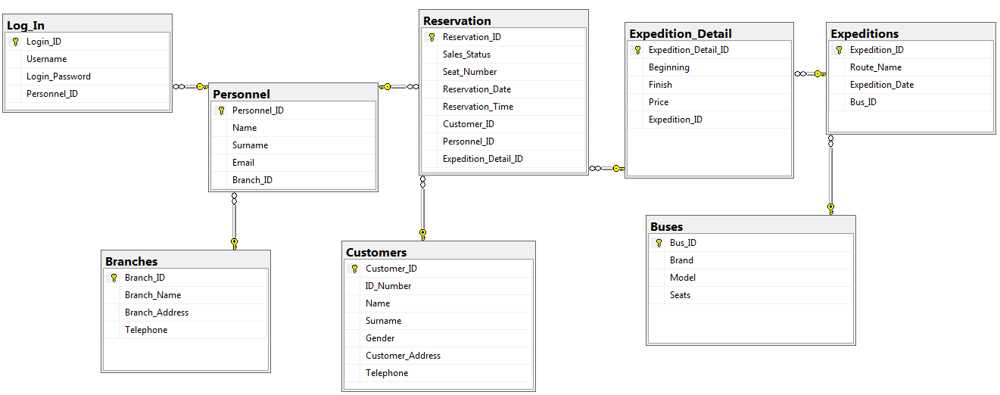

# SQL_Project
GetBus24 Database Project

### Description
An automation program will be prepared for the GetBus24 intercity bus company.

In the preparation of this automation system;

•	Ticket reservation or sales transactions which made in different offices will be gathering in a single-center,

•	Head offices and branch offices being aware of each other in the ticket reservation and sales transactions,

•	It is intended that users who visit the website can book tickets online for their travels.

In this automation system, customers first need to be a member of the "Road Card" application to benefit from the Online Ticket Booking service.
For membership, customers need to go to any branch; they must fill in the application form containing the  Identity Number, Name, Surname, Gender, Email, and Telephone information. 
As a result of this process, customers will be able to make ticket orders using their Identity Numbers in their online reservations.

Customers who don't want to book tickets on the Internet will be able to order tickets with their Identity Numbers by going to any branch connected to this automation system.
Head office or other branches querying in which office is booked or sold of the ticket; they will be able to access its name, address, and telephone number.

To prevent the use of the automation program by unauthorized persons, each branch employee has to enter their First Name, Last Name, Email, User Name,
and Password in this system. In this way, will be gathering information about the employee who has booked or sold a ticket.

By creating a unique ID for each intercity trip on different days and times; the name of the route, the Date and Time of the Expedition, with which Bus the Expedition will be made, the Brand, Model and Seat Number of the bus will also be entered into the automation system as expedition information.

However, the customer may want to get off at a different point on the start and end route of an expedition. 
In this case, the ticket should be charged according to which route the customer will get off.

Finally, by reservation queries; the customer's "Road Card" number, route information, expedition number, sales status of the ticket,
seat number, date, time and information of which employee performed these operations can also be seen.

### DBMS - 5NF

### Database Diagrams

